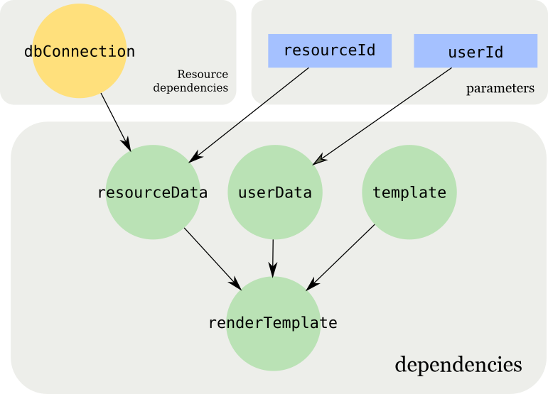

# Sistema

Sistema is a lightweight dependency injection library for node.js. It makes possible to write fast, testable, observable and reliable applications (check these claims at the bottom!).

## Dependency

The core concept of sistema is the _dependency_:

```js
const { Dependency } = require("sistema")
const { Client } = require("pg")

const dbConnection = new Dependency().provides(async () => {
  const client = new Client()
  // Connect to the PostgreSQL database
  return client.connect()
})
```

A dependency runs a function and provides a value. The value could be either a regular function of a function returning a promise.

A dependency can depend on other dependencies (just one in the example but they can be multiple!):

```js
const usersQuery = new Dependency()
  .dependsOn(dbConnection)
  .provides(async (client) => {
    const result = await client.query("SELECT * FROM users")
    return result.rows
  })
```

A dependency is executed with the **run** method:

```js
const rows = await usersQuery.run()
rows.forEach((row) => console.log(row))
```

The return value of _run_ is always a promise.

## Parameters

A dependency can take parameters, these are expressed as strings (or Symbols):

```js
const userQuery = new Dependency()
  .dependsOn(dbConnection, "userId")
  .provides(async (client, userId) => {
    const result = await client.query("SELECT * FROM users WHERE ID = $1", [
      userId,
    ])
    return result.rows[0]
  })
```

and must be passed in the run method as object values.

```js
await userQuery.run({ userId: 12345 })
```

## ResourceDependencies and context

In the previous example we opened a database connection every time we needed a dbConnection.
Dependencies like that should behave like _resources_: they are created once, used as many times as needed and then disposed (closing a database connection, for example).
We call them _ResourceDependencies_:

```js
const { ResourceDependency } = require("sistema")
const { Client } = require("pg")

let client

const dbConnection = new ResourceDependency()
  .provides(async () => {
    client = new Client()
    // Connect to the PostgreSQL database
    return client.connect()
  })
  .disposes(() => {
    client.end()
  })
```

This way the connection is established only the first time and reused across multiple usages of run.

The dependency/resourceDependency executions are preserved in an object called _defaultContext_. This exposes a method that allows to shutdown all dependencies in the right order.

```js
const { defaultContext } = require("sistema")

await userQuery.run({ userId: 12345 })
// ...
await defaultContext.shutdown() // this shuts down all dependencies that have been executed in the default context
```

The shutdown respects the order in which dependencies are connected so for example, we ensure that all queries to a database are through before closing the db connection.

- A Dependency shuts down when there are no in-flights calls to the function provided.
- A ResourceDependency shuts down when the dispose function ran its course.

Once a _Dependency_ or a _ResourceDependency_ are shut down, they no longer work and return an exception when called.

## Reset

It is possible to reset a graph of dependencies so that all ResourceDependencies are closed (their "dispose" function is called), but they can still be used and recreated.

```js
await defaultContext.reset()
```

_Reset_ can be called on an individual resourceDependency as well:

```js
await dbConnection.reset()
```

## Multiple contexts

When dealing with dependencies that are part of different lifecycles you can use more than one context.
So that shutting down (or resetting) a group of dependencies doesn't shut down dependencies that are used in another context.
The new context need to be passed to _run_:

```js
const { Context } = require("sistema")

const customContext = new Context()

await userQuery.run({ userId: 12345 }, customContext)
// ...
await customContext.shutdown() // this shuts down all dependencies that have been executed in customContext
```

If a dependency belongs to multiple context, it is only shutdown after all context it belongs shut down.

## Run multiple dependencies at once

Theoretically, _Promise.all_ can be used to run multiple dependencies at once:

```js
const [a, b] = await Promise.all([depA.run(), depB.run()])
```

This should return the correct result (if the dependencies are pure functions). But common dependencies can be executed multiple times. To avoid this, you can use run:

```js
const { run } = require("sistema")
const [a, b] = await run([depA, depB])
```

"run" can also be used to run a single dependency:

```js
depA.run()
// is equivalent to
run(depA)
```

# Observability

Sistema has some facility to help observe how the system works and to make debugging and logging easier.

## Names

Both Dependency, ResourceDependency and Context, can have a descriptive name:

```js
const userQuery = new Dependency('User query')...
```

That can be read in the name attribute:

```js
console.log(userQuery.name) // 'User query'
```

## Context events

A context can be configured with event handlers that are executed when a dependency is executed with success or fail. Same for the shutdown and reset.

```js
const { CONTEXT_EVENTS } = require("sistema")

const context = new Context("main context")
  .on(
    CONTEXT_EVENTS.SUCCESS_RUN,
    ({ dependency, context, timeStart, timeEnd }) => {
      // example: 'User query ran by the main context in 14 ms'
      console.log(
        `${dependency.name} ran by the ${context.name} in ${
          timeEnd - timeStart
        } ms`
      )
    }
  )
  .on(
    CONTEXT_EVENTS.FAIL_RUN,
    ({ dependency, context, timeStart, timeEnd, error }) => {
      console.log(
        `${dependency.name} ran with Error (${error.message}) by the ${
          context.name
        } in ${timeEnd - timeStart} ms`
      )
    }
  )
```

It is also possible to add events to the defaultContext.
Here is a list of the events:

| Events           | Parameters                                     |
| ---------------- | ---------------------------------------------- |
| SUCCESS_RUN      | dependency, context, timeStart, timeEnd        |
| FAIL_RUN         | dependency, context, timeStart, timeEnd, error |
| SUCCESS_SHUTDOWN | dependency, context, timeStart, timeEnd        |
| FAIL_SHUTDOWN    | dependency, context, timeStart, timeEnd, error |
| SUCCESS_RESET    | dependency, context, timeStart, timeEnd        |
| FAIL_RESET       | dependency, context, timeStart, timeEnd, error |

And the parameters:

- **dependency**: the dependency object
- **context**: the context object
- **timestart, timeEnd**: timeStamp when a dependency started/ended the process
- **error**: the error thrown

## Dependencies attributes

Dependencies have extra attributes and methods that help with the debugging:

```js
const dep = new ResourceDependency("Test")
dep.toString() // returns "ResourceDependency Test"
dep.getEdges() // returns the dependencies as an array
dep.getInverseEdges() // returns all the dependents as an array
```

## Adjacency list

In case is required to have a list of all dependencies connected you can use `getAdjacencyList`.

```js
const { getAdjancencyList } = require("sistema")
const a = new Dependency()
const b = new Dependency().dependsOn(a)
const c = new Dependency().dependsOn(a, b)

getAdjancencyList(a) // [a]
getAdjancencyList(b) // [b, a]
getAdjancencyList(c) // [c, b, a]
```

`getAdjancencyList` works also with an array of dependencies.
Context and dependencies have a getAdjacencyList method.
`Dependency.prototype.getAdjacencyList` is a shorthand to run getAdjancencyList with a single dependency.
`Context.prototype.getAdjacencyList` returns all dependencies that have been executed so far in the context.
Here is an example on how to use `getAdjancencyList` to print the adjacency list in JSON, for example:

```js
const adj = {}
for (const d in dep.getAdjacencyList()) {
  adj[d.name] = d.getEdges().map((d) => d.name)
}
console.log(JSON.stringify(adj))
```

## Meta dependency

It is a special dependency that shows information about the execution. It contains a field **timings** with the execution order and timing of the dependencies executed before.

```js
const { META_DEPENDENCY } = require("sistema")
const [myDependencyValue, { timings }] = await run([
  myDependency,
  META_DEPENDENCY,
])
```

_timings_ is an array of objects.
Every object has:

- **context**: the context used
- **dependency**: the dependency that was executed
- **timeStart**: the time when the dependency started its execution
- **timeEnd**: the time when the dependency ended its execution

You can use META_DEPENDENCY as a regular dependency as well.

## Execution id

You can use the execution id to keep the relation between all dependencies. By default is a UUID generated on each execution. But it can also be passed:

```js
const b = new Dependency().dependsOn(a, EXECUTION_ID).provides((a, id) => {
  // ...
})

const [EXECUTION_ID] = await run({ [EXECUTION_ID]: "myid" })
```

# Testability

Sistema improves the testability of the codebase because, taking care of wiring dependencies between them, it leaves simple dependencies that can be tested in isolation.
Mocking a dependency is super easy. Just pass it in the run method using a Map:

```js
const args = new Map([
  [userId, 12345],
  [dbConnection, connectionMock],
])
await userQuery.run(args)
```

_connectionMock_ will be used instead of dbConnection.
This can be used to mock some or even all of the dependencies in the dependency graph. To implement unit and integration tests.

## Sistema Design principles

**Sistema** (Italian for "system") allows to express an application as a directed acyclic graph of functions. It executes the graphs of functions so that the dependencies constraint is respected. The algorithm is a derivative of DFS similar to [topological sorting](https://en.wikipedia.org/wiki/Topological_sorting) that walks multiple graph edges in parallel. In the same way is possible to shutdown the dependencies in the inverse order.



**Sistema** does one thing well. It integrates with other libraries rather than being an invasive framework. It has no dependencies and only a small amount of dev dependencies. It uses types but no transpilation for the best dev experience.

Sistema is:

- FAST: dependencies are executed in parallel, in the optimal order and only once every execution
- TESTABLE: Sistema takes care of the wiring, so that dependencies can be tested in isolation
- OBSERVABLE: Sistema has simple entry points to add logging/tracking and makes [easy to inspect how the dependencies are connected](https://github.com/sithmel/sistema-lens)
- RELIABLE: Sistema takes care of shutting dependencies in the right order
